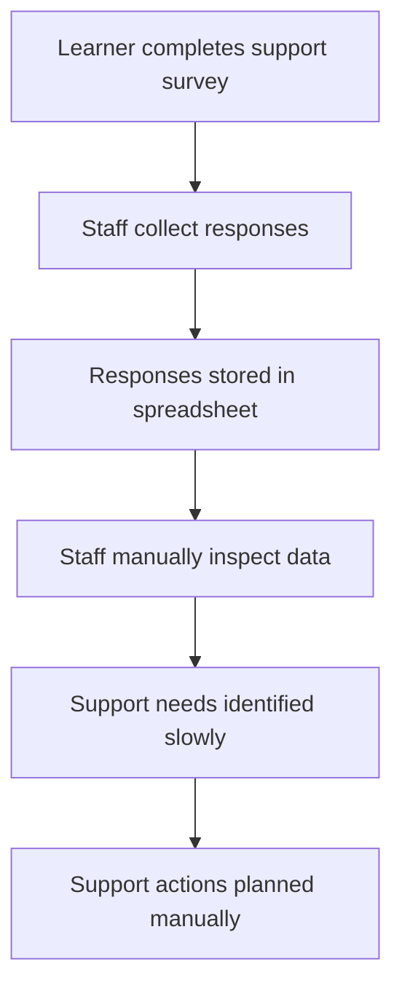

# As-Is Learner Support Process

## Current Process Problems

1. Manual review takes time.
2. High-risk learners may be identified late.
3. Data quality issues are not always noticed.
4. Programme-level support patterns are difficult to see.
5. Recommendations are inconsistent because analysis depends on manual interpretation.
