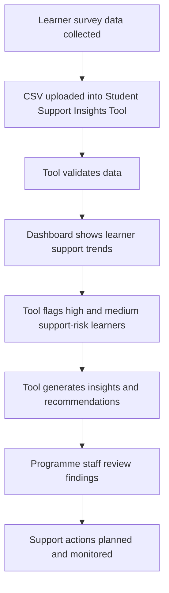

# To-Be Learner Support Process

## Improvements

1. Faster analysis of learner survey data.
2. Better data quality through missing value, invalid value, and duplicate checks.
3. Clearer visibility of support needs through dashboard visualisations.
4. Earlier identification of learners needing support.
5. Human review remains part of the process before any action is taken.
